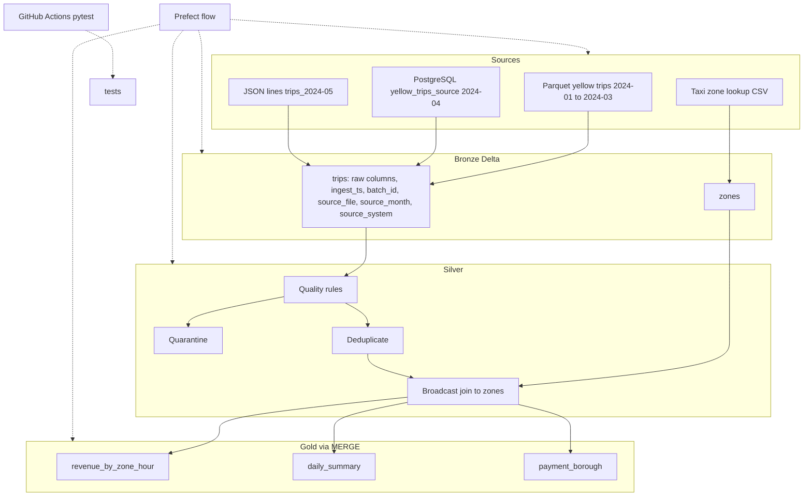

# TripFlow Lakehouse Pipeline

Local medallion pipeline for NYC yellow taxi trips: land raw files in Delta Lake, then refine them from Bronze through Gold.


**Tech stack:** Python, PySpark, SQL, Delta Lake, PostgreSQL, Prefect, Parquet/CSV/JSON, Git, GitHub Actions, pytest.

## Architecture

Prefect runs each step as its own process. GitHub Actions runs the pytest suite on Ubuntu.



`source_system` is `parquet`, `postgres`, or `json`. Bronze keeps the source rows as landed. Silver applies the rules, quarantines failures, drops duplicate trips, and attaches zone names with a broadcast join.

## Data sources

| Source | What lands in Bronze | Rows |
| --- | --- | ---: |
| Parquet `yellow_tripdata_2024-01` through `2024-03` | Yellow trips, `source_system=parquet` | about 9.55 million |
| PostgreSQL `public.yellow_trips_source` via Spark JDBC | April 2024 sample, `source_system=postgres` | 500,000 |
| JSON lines `data/raw/json/trips_2024-05` | May 2024 sample, `source_system=json` | 300,000 |
| Taxi zone lookup CSV | Zone dimension | lookup |
| **Bronze trips total** | | **10,354,778** |

April keeps the first 500,000 rows whose pickup month is 2024-04. May keeps the first 300,000 rows whose pickup month is 2024-05. January–March stay on the full TLC parquet files.

## Results

Silver reconciliation requires `bronze_rows = silver_rows + quarantined_rows + duplicates_removed`. Every month passed.

| source_month | bronze | silver | quarantined | duplicates removed | check |
| --- | ---: | ---: | ---: | ---: | --- |
| 2024-01 | 2,964,624 | 2,869,937 | 94,687 | 0 | passed |
| 2024-02 | 3,007,526 | 2,901,733 | 105,792 | 1 | passed |
| 2024-03 | 3,582,628 | 3,440,451 | 142,177 | 0 | passed |
| 2024-04 | 500,000 | 485,208 | 14,792 | 0 | passed |
| 2024-05 | 300,000 | 292,385 | 7,615 | 0 | passed |
| **Total** | **10,354,778** | **9,989,714** | **365,063** | **1** | **passed** |

Quarantine reasons:

| reject_reason | rows |
| --- | ---: |
| invalid_distance | 223,343 |
| negative_fare_or_total | 135,921 |
| dropoff_not_after_pickup | 3,016 |
| pickup_outside_source_month | 2,728 |
| duration_over_24h | 55 |

Gold row counts:

| table | rows |
| --- | ---: |
| revenue_by_zone_hour | 248,822 |
| daily_summary | 99 |
| payment_borough | 171 |

`silver_rows = gold_trips = 9,989,714`. `gold_trips` is the sum of `trips` on `daily_summary`.

## Idempotency and MERGE

Bronze skips a `source_month` that is already in the trips table, so a second run does not append January–May again. Silver overwrites only the month it is building, using Delta `replaceWhere`. Gold merges on the business key: the first run inserts, and a rerun updates matching rows with `numTargetRowsInserted = 0`.

Delta is the table format because those three writes have to be safe on files. An append, a single-month replace, and a key-based merge each commit as one table version, so a failed step does not leave a half-written month, and the next run can see what is already there.

## Optimization

`docs/benchmark_results.md` compares a 200-file Silver copy with a copy partitioned by `source_month` and Z-ordered by `pu_location_id` and `pickup_date`. The optimized copy is 3 files. End to end the queries drop from 10.7 s to 4.1 s, about 2.6x. Z-ORDER adds little at this data size; the gain is mostly fewer files and partition pruning.

| copy | files | size_bytes |
| --- | ---: | ---: |
| baseline | 200 | 296,130,558 |
| optimized | 3 | 249,346,465 |

Q3 uses the optimized copy for both timings. `baseline_s` is the join with no broadcast hint; `optimized_s` is `broadcast(zones)`.

| query | baseline_s | optimized_s | speedup_x |
| --- | ---: | ---: | ---: |
| Q1 | 2.606 | 0.839 | 3.11 |
| Q2 | 1.910 | 0.842 | 2.27 |
| Q3 | 6.200 | 2.428 | 2.55 |

Total baseline: 10.716 s. Total optimized: 4.109 s.

## Project structure

```
flows/tripflow_flow.py          Prefect flow
src/common/                     paths, Spark session, Postgres
src/bronze/                     download, parquet, JDBC, JSON, zones
src/silver/                     rules, quarantine, dedup, reconciliation
src/gold/build_gold.py          three MERGE tables
src/optimize/benchmark.py       layout benchmark
tests/                          rules and Delta merge
scripts/                        inspect Bronze and Gold
docs/benchmark_results.md
.github/workflows/ci.yml
data/                           local lakehouse, gitignored
.env.example
```

## How to run

Prerequisites: Python 3.11, Java 17 or 21, and PostgreSQL. On Windows, Hadoop `winutils` must be available (`HADOOP_HOME`).

Copy `.env.example` to `.env` and set `PG_PASSWORD`. The other placeholders are `PG_HOST`, `PG_PORT`, `PG_DB`, and `PG_USER`. The database named by `PG_DB` must exist.

From the project root, with the virtual environment active:

```powershell
python -m flows.tripflow_flow
```

`--skip-download` skips the TLC download. `--months` limits the Gold build, for example `--months 2024-03`.

The same steps, one module at a time:

```powershell
python -m src.bronze.download_data
python -m src.bronze.ingest_zones
python -m src.bronze.ingest_trips
python -m src.bronze.load_postgres_source
python -m src.bronze.ingest_postgres
python -m src.bronze.export_json_source
python -m src.bronze.ingest_json
python -m src.silver.build_silver
python -m src.gold.build_gold
python -m pytest -q
```

`python -m src.optimize.benchmark` rewrites `docs/benchmark_results.md`. GitHub Actions runs `python -m pytest -q` on Ubuntu.

## Design decisions and limitations

Local Delta paths stand in for ADLS Gen2. Prefect stands in for Azure Data Factory. The run is five months on a laptop: full parquet for January–March, a 500,000-row PostgreSQL sample for April, and a 300,000-row JSON sample for May. On Windows, Spark can log an error while deleting `.spark_tmp` during shutdown; the step has already finished, and that message is harmless.
